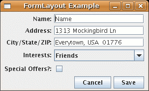

SwingFormLayout
===============

This project implements a form-style layout to make it trivial to make Java
containers of the following form:

Usage
-----

<pre>
import com.wjblack.FormLayout;

[...control creation...]
   
// The form panel
JPanel form = new JPanel();
FormLayout layout = new FormLayout(form);
form.setLayout(layout);
form.add("Name", name);
form.add("Address", address);
form.add("City/State/ZIP", csz);
form.add("Interests", interests);
form.add("Special Offers?", spam);
form.add(FormLayout.BUTTONAREA, cancel);
form.add(FormLayout.BUTTONAREA, save);
   
[...assign to JFrame, etc...]
</pre>

Compilation
-----------

You can build the JARfile by just typing "ant".

"ant example" will also build and run the example program in example/.

The JARfile for the library will appear in dist/lib.

License
-------

Released to an unsuspecting planet under the WTFPL.  See COPYING.
